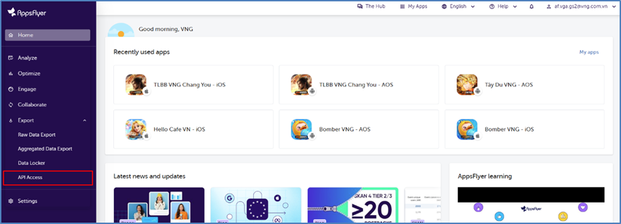
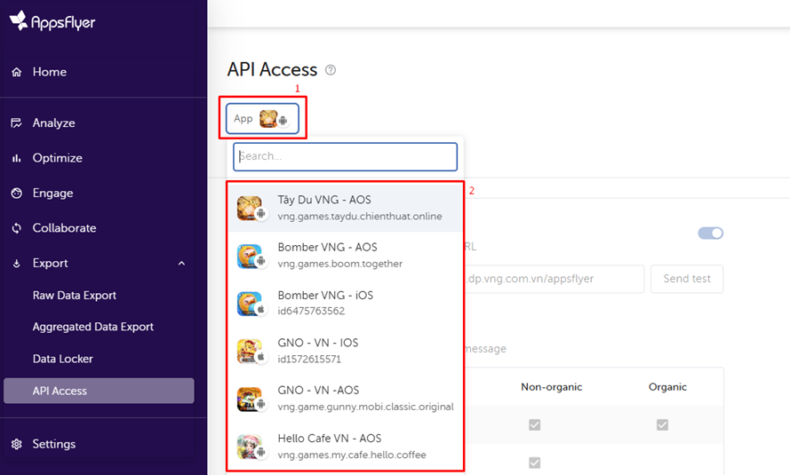

# 1.1. Playbook - Data Integration 2.0

**This document is intended to help GS understand the data integration process for a new game, ensuring the best preparation and coordination with GDS.** The official email for logs integration is [GDS_Integrate@vng.com.vn](GDS_Integrate@vng.com.vn).

## I. DATA INTEGRATION PROCESS

### 1. Timeline Proposal

This is the game data integration timeline we provide if your game utilizes the full range of services offered by GDS. This timeline solely represents GDS's service commitment and does not include any pending time on the part of GS or partners during the implementation process.

If your game does not use all the services provided by GDS or follows a special model different from the current model at VNGGames, please contact GDS for further discussions and adjustments.

### 2. Project Information
This is the project information template we need to collect when integrating data for a new game. The information collection process will begin as soon as the game kicks off and will continue throughout the integration process.

We will provide you with a SharePoint Excel file that consolidates all the necessary information related to your game project. The entire process will be tracked and summarized in this file, including the timeline, process, log requirements, log reviews, and GDS PICs.

### 3. Integration Task List

| ID | Task Group | Task Details | What will be delivered when it's done? | What needs to be done before starting? |
|:---|:---|:---|:---|:---|
| I  | | | | |
| 1  | Gather information | Collect information about the game that is about to released following the template | | |
| 2  | | Send the data integration information package of VNG to the Developer. | Align on the logs schema and the method for sending and receiving logs. | | |
| II  | | | | |
| III | | | | |
| 1   | Go Live | Rating & Recommendation for improvement | [https://forms.office.com/r/ZBC9q0wKDZ]() | |

## II. THIRD PARTY DATA

### 1. Appsflyer Data

*Guide to Setting Up an API PUSH Endpoint to Receive Real-Time Data from Appsflyer*

#### a. Understand Appsflyer's Real-Time Postbacks
Appsflyer sends real-time postbacks to an external endpoint whenever specific in-app events or actions occur (e.g., installs, purchases, app launches, etc.). Your job is to configure an endpoint to receive this data.

#### b. Configure Your Endpoint URL in Appsflyer
- Log in to Appsflyer Dashboard.
- Navigate to the **Export – API Access** section.

- Choose the app you want to integrate.

- Set Up Real-Time Postbacks.
